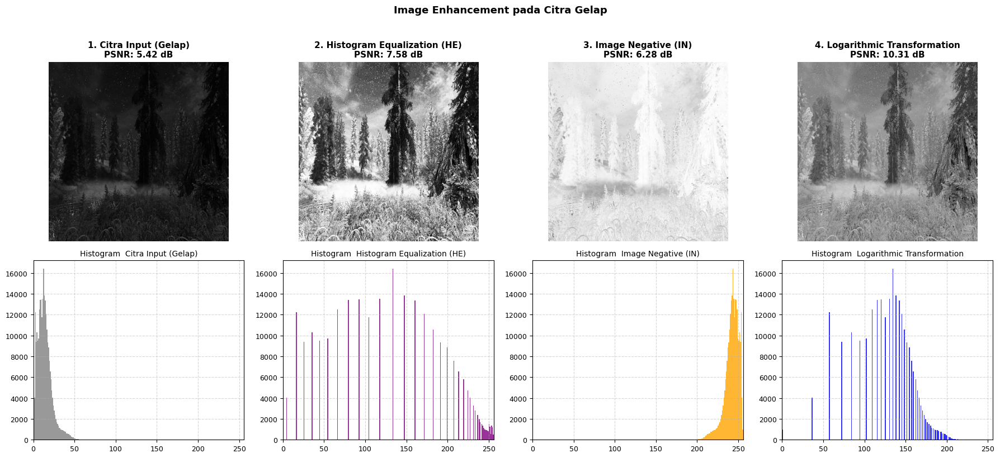
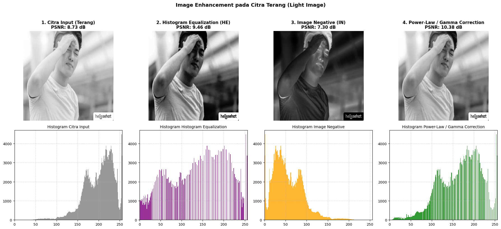
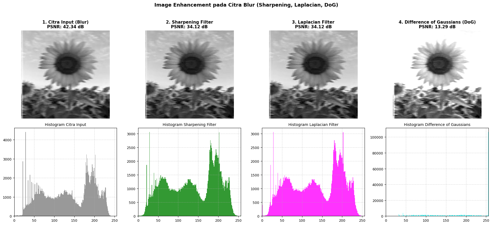
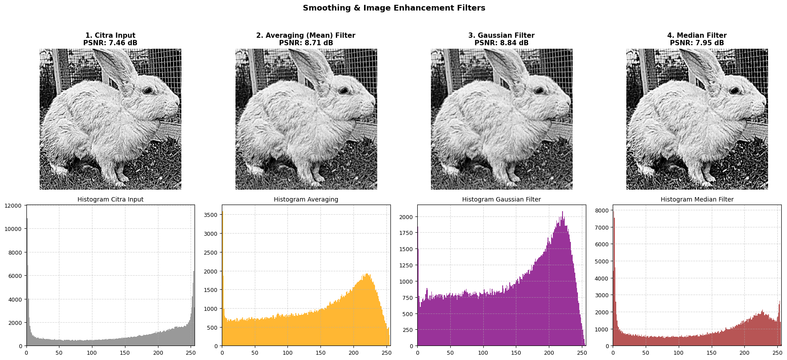
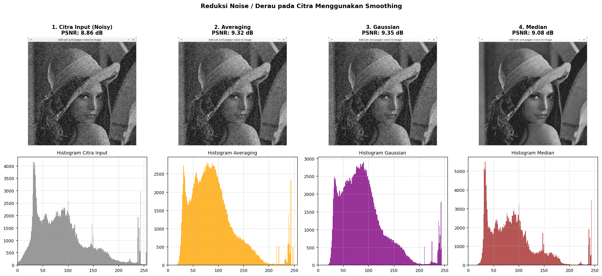
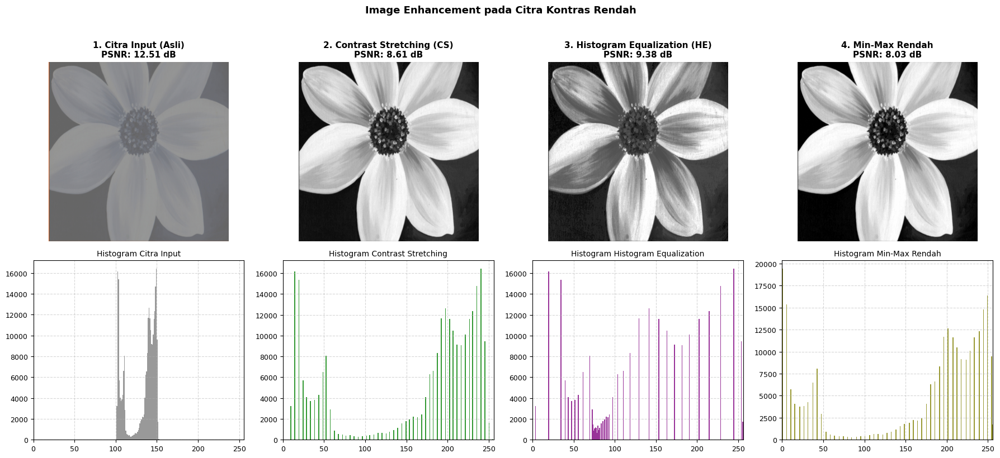
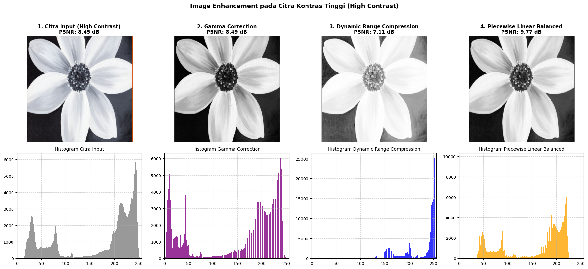
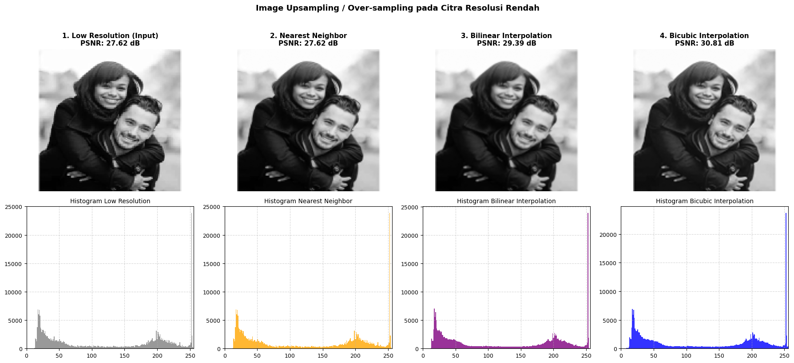

  <!-- Animasi Kuda Poni di Atas -->
  
    
  
  
  <!-- Animasi Kuda Poni Kecil di Samping Judul -->
  
   
  
  
  
<b>NAMA :</b> SERLY ELDINA &nbsp; | &nbsp; <b>NIM :</b> 26/589324/PPA/07352

 

<h3></h3>

<table>
  <tr bgcolor="#FF1493" style="color: white; text-align: left;">
    <th width="50" style="text-align: center;">No.</th>
    <th width="300">Image Condition</th>
  </tr>
  <tr bgcolor="#FFC0CB" style="color: black;">
    <td style="text-align: center;">1</td>
    <td>Under Exposure</td>
  </tr>
  <tr bgcolor="#FFF0F5" style="color: black;">
    <td style="text-align: center;">2</td>
    <td>Over Exposure</td>
  </tr>
  <tr bgcolor="#FFC0CB" style="color: black;">
    <td style="text-align: center;">3</td>
    <td>Blurred Image</td>
  </tr>
  <tr bgcolor="#FFF0F5" style="color: black;">
    <td style="text-align: center;">4</td>
    <td>Oversharpened Image</td>
  </tr>
  <tr bgcolor="#FFC0CB" style="color: black;">
    <td style="text-align: center;">5</td>
    <td>Noisy Image</td>
  </tr>
  <tr bgcolor="#FFF0F5" style="color: black;">
    <td style="text-align: center;">6</td>
    <td>Low Contrast</td>
  </tr>
  <tr bgcolor="#FFC0CB" style="color: black;">
    <td style="text-align: center;">7</td>
    <td>High Contrast</td>
  </tr>
  <tr bgcolor="#FFF0F5" style="color: black;">
    <td style="text-align: center;">8</td>
    <td>Low Resolution</td>
  </tr>
</table>

 

<h3></h3>

<table>
  <tr bgcolor="#FF1493" style="color: white; text-align: left;">
    <th width="200">Image Condition</th>
    <th>Result Image</th>
  </tr>
  <tr bgcolor="#FFC0CB" style="color: black;">
    <td><b>Under Exposure</b></td>
    <td></td>
  </tr>
  <tr bgcolor="#FFF0F5" style="color: black;">
    <td><b>Over Exposure</b></td>
    <td></td>
  </tr>
  <tr bgcolor="#FFC0CB" style="color: black;">
    <td><b>Blurred Image</b></td>
    <td></td>
  </tr>
  <tr bgcolor="#FFF0F5" style="color: black;">
    <td><b>Oversharpened Image</b></td>
    <td></td>
  </tr>
  <tr bgcolor="#FFC0CB" style="color: black;">
    <td><b>Noisy Image</b></td>
    <td></td>
  </tr>
  <tr bgcolor="#FFF0F5" style="color: black;">
    <td><b>Low Contrast</b></td>
    <td></td>
  </tr>
  <tr bgcolor="#FFC0CB" style="color: black;">
    <td><b>High Contrast</b></td>
    <td></td>
  </tr>
  <tr bgcolor="#FFF0F5" style="color: black;">
    <td><b>Low Resolution</b></td>
    <td></td>
  </tr>
</table>

 
